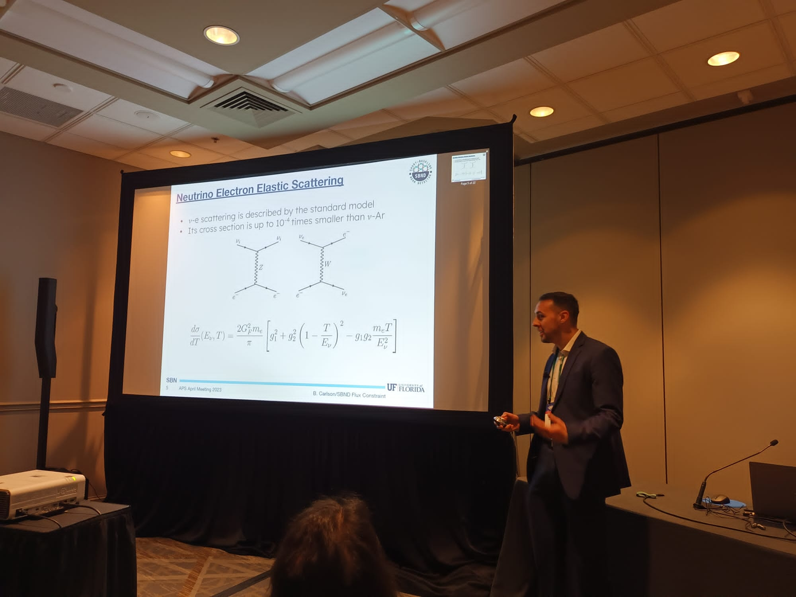

# Presentations

  

## Conference Presentations

### [Conference Name] - [Year]
- **Title:** [Presentation Title]
- **Location:** [Conference Location]
- **Date:** [Date]
- **Abstract:** [Brief description of the presentation]

### [Another Conference] - [Year]
- **Title:** [Presentation Title]
- **Location:** [Conference Location]
- **Date:** [Date]
- **Abstract:** [Brief description of the presentation]

## Collaboration Meetings

### [Collaboration Meeting] - [Year]
- **Title:** [Talk Title]
- **Location:** [Meeting Location]
- **Date:** [Date]
- **Abstract:** [Brief description of the talk]

## Department Seminars

### [Department Seminar] - [Year]
- **Title:** [Seminar Title]
- **Location:** [University/Department]
- **Date:** [Date]
- **Abstract:** [Brief description of the seminar]

---

[Back to Home](index.md)

